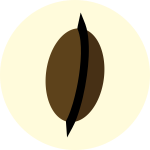

# Coffee break

[](https://crates.io/crates/coffee_break)
[](https://docs.rs/coffee_break)



Coffee break is a 🔥 blazing 🚀 fast 🦀 Rust 🥵 library, by Rust developers for Rust developers. It is:
- **Developer-friendly**: Lets you take a break while compiling your code.
- **Eco-friendly**: The compiler is just taking a nap. We're not computing the Ackermann function just to slack off.
- **Language server-~~un~~friendly**: `rust-analyzer` has insomnia now.

## Overview


*A classic [XKCD webcomic](https://imgs.xkcd.com/comics/compiling.png)*

45% of respondents to the [2023 Rust survey](https://blog.rust-lang.org/2024/02/19/2023-Rust-Annual-Survey-2023-results.html) were concerned with Rust's compile times, and they're right: they're **too dang fast**!

In the before times when working on old C++ projects, we used to get 10 to 40 minutes of free time after we hit compile to do whatever we wanted. Developers' computers had no more than 2 to 4 CPU cores, and Makefiles were often not configured to run in parallel at all.

Nowadays, the devious Rust compiler developers are trying to make the compiler even faster, and they're slowly succeeding.

Here comes **Coffee break**, a friendly developer tool to make this problem go away.

## Example

Before you run `cargo build`, reward yourself with a coffee break:
```rust
use coffee_break::coffee_break;

fn work_stuff() {
    let maybe = |(true|false)||(false|true)||(true|false)|true;
    let absolutely = maybe(true)(true)(true);

    // Take a break and hit compile
    coffee_break!(5 minutes);
}
```

You just got 5 minutes to stretch your legs, get a coffee, or make Friday afternoon a bit nicer.

You can take a break for up to 251 minutes, or up to 1319 seconds. These limits are arbitrary, and will **not** be changed for any reason, unless the author changes their mind.

This crate requires correct grammar:
```rust
fn work_stuff() {
    coffee_break!(1 second); // OK
    coffee_break!(5 minutes); // OK
    // coffee_break!(59 second); // Error
    // coffee_break!(1 minutes); // Error
}
```

You can still run `cargo check` and `cargo clippy` without having to wait.

## Notes
The author doesn't drink coffee, but still enjoys taking a break.

## Contributing
Before contributing to this project, consider taking a coffee break first.

PRs are welcome.
The first paragraph of any PR message must be a haiku describing the changes.

Please follow the [community guidelines](https://www.rust-lang.org/policies/code-of-conduct).

## License

This project is licensed under a [license](./LICENSE) modeled on the [JSON license](https://www.json.org/license.html). Evil doesn't deserve a break.

### Contribution
Unless you explicitly state otherwise, any contribution intentionally submitted for inclusion in Coffee break by you, shall be licensed with this repository's license, without any additional terms or conditions.
